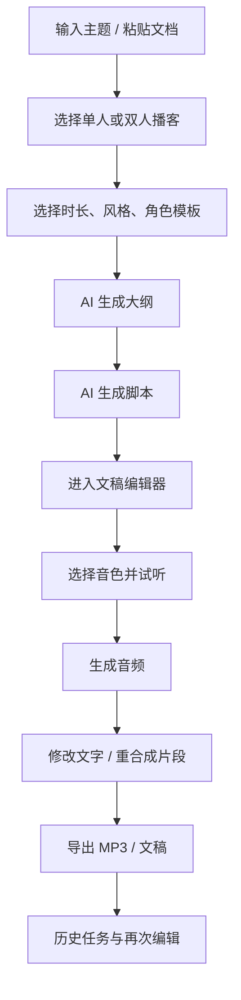
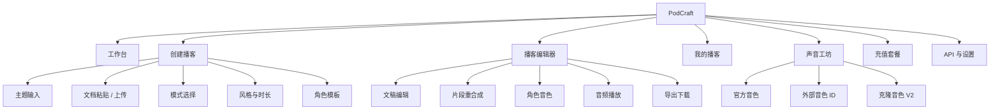
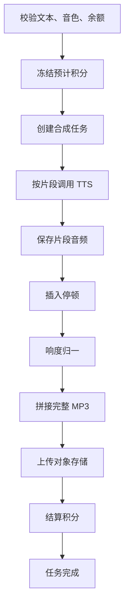
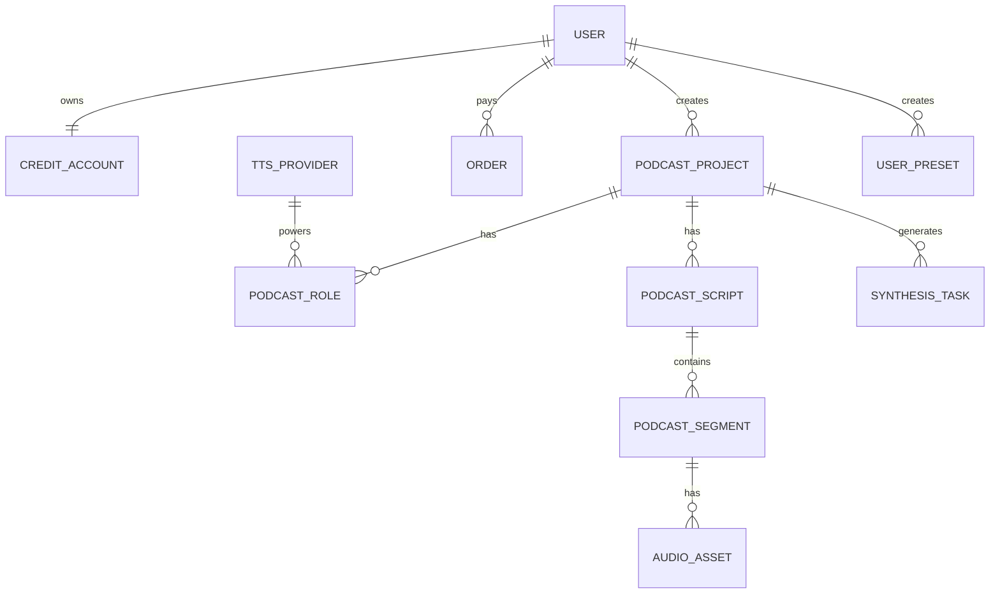
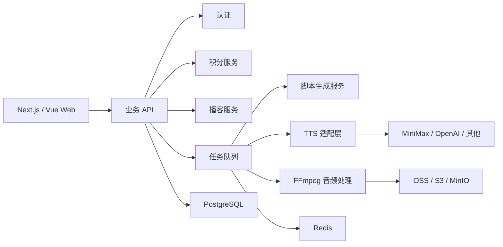
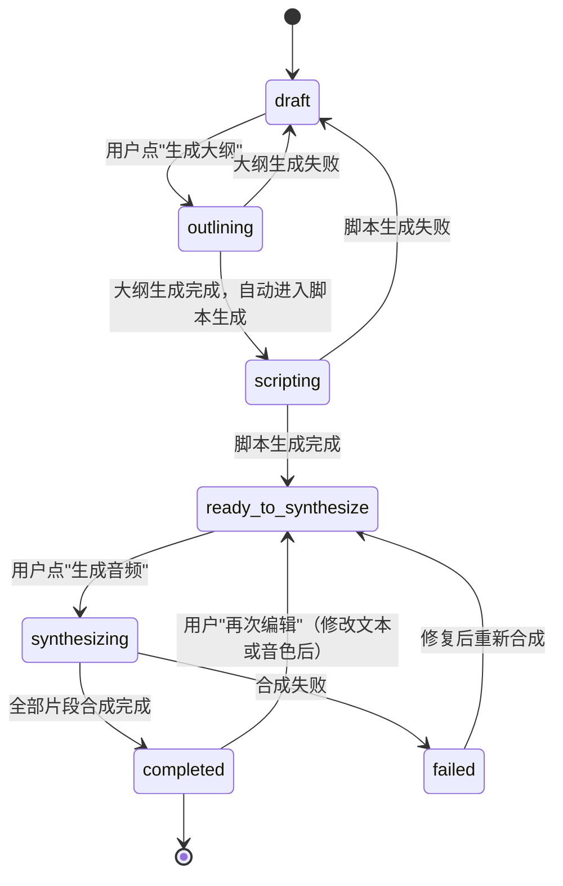

# PodCraft AI 播客产品设计方案（V3.0）

> 生成日期：2026-05-25  
> 版本：V3.0（基于 V2.0 更新）  
> 依据：AI生成播客应用_产品设计方案.md、PodCraft产品方案设计.md、前期横纵分析报告、产品战略团队五方评审报告（V2.0）、4 份原型分析研究报告（需求分析、用户研究、竞品分析、数据分析）

---

## 📝 更新日志（V2.0 → V3.0）

| # | 更新位置 | 更新类型 | 更新内容 | 来源 |
|---|---------|---------|---------|------|
| 1 | §3.2 产品体验原则 | 【更新】 | 补充"所有生成前展示预计消耗"的具体实现规则；补充"能自动的不让用户选"原则 | 瑞思、数析 |
| 2 | §5.1 MVP 必做 | 【更新】 | 补充"情绪风格选择"、"方言/语言增强"、"文本标记语言"为 P0 必做；"声音效果器"降至 P1 | 析客、竞析、数析 |
| 3 | §5.2 MVP 不做 | 【更新】 | 明确"修改语速"延后至 V0.3；"声音效果器"降至 V1.5 | 析客、数析 |
| 4 | §6.2 播客编辑器页 | 【更新】 | 补充"音频播放器"详细设计；补充"一键重新生成片段"UI 设计；补充"删除片段"和"失败重试"UI 设计；补充"快捷工具栏"描述；补充"预计消耗积分"展示规则 | 析客、瑞思、竞析 |
| 5 | §7.3 音频合成 | 【更新】 | 补充"合成参数详细配置"表格（语速/音调/音量/情绪/语言增强）；补充"音效处理"步骤（V1.5） | 析客、竞析 |
| 6 | §7.4 TTS Provider 抽象 | 【更新】 | 接口新增 `voiceEffects` 可选参数；新增 `soundEffect` 参数 | 竞析 |
| 7 | §7.5 新增章节 | 【新增】 | "文本标记语言规范"章节：定义 `<#N#>` 停顿、多音字标记、语气词标记 | 竞析 |
| 8 | §7.6 新增章节 | 【新增】 | "方言与语言增强"章节：定义方言 Provider 映射和音质标准 | 竞析、数析 |
| 9 | §8.2 表设计草案 | 【更新】 | 更新 `voice_presets` 表（新增 `language`、`voice_params`、`is_cloned`、`clone_source`、`usage_count` 字段）；新增 `user_presets` 表（P2） | 析客、竞析 |
| 10 | §9.3 MVP 计费规则 | 【更新】 | 补充"音色调节/声音效果器/音效选择是否触发重合成"的计费规则；补充"试听功能不扣费"规则 | 数析 |
| 11 | §11.3 失败处理 | 【更新】 | 补充"用户频繁重试同一片段"风控规则；补充"声音效果器导致音质异常"降级规则 | 数析 |
| 12 | §12 管理后台 | 【更新】 | 补充"数据埋点附录"；补充"漏斗分析看板"；补充"成本监控看板" | 数析 |
| 13 | §13.1 MVP 上线 2 周指标 | 【更新】 | 补充"首次生成满意度"、"分享率"指标定义；补充所有指标的"计算方式"和"数据来源" | 瑞思、数析 |
| 14 | §13.1 新增 | 【新增】 | "埋点定义"表格：定义 `segment_edit`、`segment_resynthesize_click`、`export_click`、`share_click` 等事件 | 瑞思、数析 |
| 15 | §15.4 V1.0 商业化版 | 【更新】 | 明确"移动端适配"为 V1.0 必须（目标用户大量使用移动设备） | 瑞思 |

---

## 1. 产品定位

### 1.1 一句话定义

PodCraft 是一个 AI 播客创作台：输入主题或文档，生成单人 / 双人播客；用户像改文档一样修改脚本，系统只重合成被修改的片段；最终导出完整 MP3，并通过积分 / 套餐完成商业化运营。

**市场规模**：中国播客听众规模 2025 年预计达 1.2 亿（PodFest China），AI 生成内容占比快速提升。目标市场为"有内容但缺音频生产能力"的知识创作者与企业，预估 TAM ¥5 亿/年。

### 1.2 核心判断

这个产品不能只做"文本转语音"，也不能第一版就做成完整音频剪辑软件。最合适的切入点是：

> 生成质量是入口，生成可控是粘性，编辑微调是差异化，运营能力是底座。

用户第一次被吸引，是因为一句话或一篇文档能变成播客。用户留下来，是因为生成质量让人愿意听，且能控制生成的方向和风格。用户深入使用，是因为他能修改、重合成、精细调整。产品能运营起来，是因为每一次生成、重试、下载、充值都有清晰的任务和计费链路。

> ⚠️ **关键假设**："编辑是差异化"而非"编辑是护城河"——护城河需要编辑使用率 ≥ 40% 才成立，需 MVP 上线 2 周内数据验证。若编辑使用率 < 25%，需重新审视产品定位。

### 1.3 差异化定位

| 产品 | 核心动作 | 优势 | 不足 | PodCraft 的机会 |
| --- | --- | --- | --- | --- |
| NotebookLM | 听资料 | 生成效果惊艳 | 脚本不可编辑、无商业化 | 做可控、可编辑、可发布的创作台 |
| ElevenLabs GenFM | 听智能播客 | 声音质量强 | 脚本不可编辑、国内支付不友好 | 做中文编辑体验和本地化商业闭环 |
| Wondercraft | API 生成音频 | 工作流和 API 强、时间线编辑 | 中文体验一般、非片段级重合成 | 做片段级重合成的轻量中文 Web 工作台 |
| Aura Studio | 语音合成 / 播客对话 | 充值、音色、历史任务完整 | AI 脚本与编辑体验不足 | 加强脚本生成和片段编辑 |
| ListenHub | 一键生成视频/播客/PPT | 多平台、声音克隆、风格模仿 | 编辑不深、无片段重合成、定位分散 | 聚焦"做播客"一件事，编辑做深做透 |
| PodCraft | 做播客 | 生成 + 编辑 + 运营 | 首版需要控制范围 | 片段重合成是全市场唯一差异化 |

---

## 2. 目标用户与核心场景

### 2.1 用户画像

| 用户 | 场景 | 痛点 | 付费理由 | 画像细分 |
| --- | --- | --- | --- | --- |
| 知识创作者 | 把选题、文章、观点做成 3-10 分钟播客 | 写脚本、录音、剪辑耗时 | 提高内容复用效率 | 专栏/公众号作者（高付费）、新手播客主（高付费）、学术/专业领域 KOL（中付费）、独立咨询师/培训师（极高付费） |
| 学习型用户 | 把论文、长文、课程资料转成可听内容 | 没时间读长文 | 通勤、运动、睡前听 | 低付费意愿，用免费替代品多（NotebookLM/TTS） |
| 企业内容团队 | 把产品资料、报告、培训材料转成音频 | 外包成本高，修改麻烦 | 批量生成、统一品牌声音 | 决策链长、定制化要求高，MVP 难以满足 |
| 私域运营团队 | 定期给社群输出音频内容 | 内容形式单一，更新压力大 | 快速产出可传播音频 | 更可能是"音频消息"需求，非"播客"需求 |

**MVP 优先服务**：知识创作者中的 **专栏作者 + 新手播客主**——需求最聚焦、付费意愿最高、最容易验证。

**暂不主动获取**：企业内容团队（伪需求陷阱：需求大但每个都带定制化前提，会让 MVP 膨胀）、私域运营团队。

### 2.2 MVP 优先服务场景

第一版优先服务三个场景：

1. **文章 / 资料转双人播客**
   用户粘贴资料，选择"主持人 + 专家"，生成一段 3-5 分钟双人解读。

2. **选题转单人播客**
   用户输入一个主题，生成一段 3-5 分钟单人口播，修改文字后局部重合成。

3. **长文 / 文档转单人解读播客**（新增）
   用户粘贴长文，生成一段单人解读播客。这是学习型用户最核心的需求，且实现成本低于双人播客。用户体验更简单：输入文档 → 选择音色 → 生成单人解读。

暂不优先服务：
- 多人圆桌。
- 视频播客。
- RSS 分发。
- 复杂音频时间线剪辑。
- AI 封面生成。
- 图片输入。
- 系列播客 / 连载管理（V1.0+）。
- 播客片段分享（V1.0+ 简单分享链接）。

---

## 3. 产品主链路

### 3.1 最小闭环



### 3.2 产品体验原则

- 用户永远先看到"能生成播客"的入口，而不是复杂参数。
- 生成结果必须可编辑，不能只给一个黑盒音频。
- 修改一句话，只重合成相关片段，不重跑整条播客。
- 所有长耗时操作都异步化，并显示状态。
- 所有生成前都展示预计消耗（以直观方式呈现，如"约 2 分钟播客 ≈ 120 积分"）。
  - **具体实现规则**：
    - 底部字数统计栏实时显示"字数: 286 · 预计时长: 02:34 · **预计消耗: 286 积分**"
    - 当 `user.balance < 预计消耗` 时，高亮提示"余额不足，请充值"，"重新合成"按钮置灰
- 所有失败都提供下一步动作。
- 内容长度硬上限：文档输入 ≤ 5000 字，脚本生成 ≤ 8000 字，单片段 ≤ 500 字。超长提示分段。
- **新增原则**：能自动的不让用户选，能推荐的不让用户想。
  - 情绪风格默认"自动（推荐）"，模型自动匹配；仅在"自动"不准确时手动指定
  - 语言/方言默认"自动检测"，仅当检测错误时手动指定

---

## 4. 信息架构



### 4.1 顶部导航

- Logo / PodCraft。
- 创建播客。
- 我的播客。
- 声音工坊。
- API。
- 教程。
- 余额。
- 充值。
- 用户菜单。

**【更新】补充"长文解读"模式入口**：
- 在"创建播客"页面，新增"长文解读"模式（与"主题输入"、"文档粘贴"并列）
- 用户粘贴长文（≤ 5000 字）后，选择"单人解读"模式，系统自动生成解读脚本

### 4.2 登录后默认页

默认进入"工作台"，展示：
- 快速创建入口。
- 最近播客。
- 推荐模板。
- 当前余额。
- 上次未完成草稿。

---

## 5. MVP 范围

### 5.1 MVP 必做

| 模块 | 功能 | 说明 |
| --- | --- | --- |
| 输入 | 主题输入 | 一句话生成单人 / 双人播客 |
| 输入 | 文档粘贴 | MVP 支持纯文本粘贴（≤ 5000 字），PDF 上传可放到 V1.1 |
| 输入 | URL 输入 | MVP 支持网页 URL 抓取正文（readability 算法） |
| 输入 | **长文解读模式** | 【新增】粘贴长文生成单人解读播客（学习型用户核心需求） |
| 模式 | 单人播客 | 生成单人口播脚本和音频 |
| 模式 | 双人播客 | 生成 A/B 双人对话 |
| 模式 | 长文→单人解读 | 粘贴长文生成单人解读播客（新增） |
| 脚本 | 大纲生成 | 先给结构，用户确认后生成脚本（大纲 MVP 只读，不可编辑） |
| 脚本 | 完整脚本生成 | 输出可编辑文稿 |
| 编辑 | 文稿编辑 | 用户直接修改每个片段文字 |
| 编辑 | 片段重合成 | 修改文字后只重合成该片段（**核心差异化卖点**） |
| 编辑 | **一键重新生成片段** | 【更新】每个段落增加"🪄 AI 优化"按钮，用户可附加简单指令（如"多举些案例"/"缩短一点"）；点击后弹出浮层，提供快捷指令芯片和自定义指令输入框；LLM 生成新文本后自动填入 textarea，状态标记为 `draft` |
| 编辑 | 删除片段 | 删除文稿和对应音频，重新拼接（直接拼接 + 50ms crossfade，保持 pause_after_ms） |
| 音色 | 5 个预设音色 | 温暖女声、知性女声、年轻男声、沉稳男声、活泼女声 |
| 音色 | **情绪风格选择** | 【新增 P0】支持 6 种情绪（自动/开心/悲伤/愤怒/惊讶/平静）；默认"自动（推荐）"，模型自动匹配 |
| 音色 | **语言/方言增强** | 【新增 P0】支持 25 种语言/方言（含粤语/四川话/东北话）；默认"自动检测" |
| 音色 | 角色绑定音色 | 双人播客角色 A/B 独立音色；允许选同一音色但提示"建议选择不同音色" |
| 合成 | 异步生成 | 任务队列、进度状态、失败提示 |
| 合成 | **合成参数配置** | 【新增 P0】语速（0.5-2.0）、音调（-12 to 12）、音量（0.0-2.0）；MVP 暴露这 3 个参数 |
| 合成 | 完整 MP3 导出 | 所有片段合成完成才能导出；有未完成片段时按钮置灰 + 提示 |
| 历史 | 我的播客 | 查看、播放、再次编辑、删除（筛选：全部 + 草稿 + 已完成三档，MVP 不做"生成中+失败"筛选） |
| 账户 | 登录注册 | 基础账号体系 |
| 计费 | 积分余额 | 生成前预估，成功扣费，失败退回 |
| 引导 | 生成引导 | 生成前增加 2-3 个简单引导项：重点/角度、风格标签、目标时长（非复杂参数，而是自然对话式输入） |
| 输入 | **文本标记语言** | 【新增 P0】支持 `<#秒数#>` 停顿、多音字标记、语气词标记（如 `(laughs)`） |

### 5.2 MVP 不做

- 图片输入。
- PDF / Word / PPT 解析。
- AI 配乐。
- 封面生成。
- 声音克隆（V1.5 开放）。
- 多语言（**【更新】MVP 做中文 + 英文，方言增强 MVP 做**）。
- 3 人以上播客。
- 复杂波形时间线编辑。
- RSS 分发。
- 插入空白片段（V0.3+）。
- 大纲编辑（MVP 大纲只读）。
- **修改语速**（segment 表无 speed 字段，延后至 V0.3）。
- **声音效果器**（音高/强度/音色；MVP 不做，降至 V1.5）。

说明：这些能力有价值，但不应挤进第一版。MVP 要验证的是"输入 -> 生成 -> 编辑 -> 导出 -> 计费"。

---

## 6. 页面设计

### 6.1 创建播客页

页面目标：让用户在 1 分钟内完成配置并发起生成。

主要区域：

| 区域 | 内容 |
| --- | --- |
| 输入方式 | 主题输入、粘贴文档、URL 输入（MVP 支持网页 URL 抓取正文）、**长文解读模式** |
| 生成引导 | 重点/角度（1-2 个关键词）、风格标签（专业解读/轻松聊天/故事讲述）、目标时长（3 分钟/5 分钟） |
| 播客模式 | 单人播客、双人播客、**长文→单人解读** |
| 内容设置 | 时长、风格、目标受众 |
| 角色模板 | 主持人 + 专家、辩论双方、好友闲聊 |
| 音色预选 | 每个角色选择音色，可试听 |
| 生成控制 | 预计消耗（直观显示如"约 2 分钟播客 ≈ 120 积分"）、生成大纲、生成播客 |

**【更新】补充"长文解读"模式 UI 设计**：
- 输入方式：text area（≤ 5000 字）
- 模式选择：单选"单人解读"
- 音色选择：下拉选择 5 个预设音色之一
- 生成按钮："生成解读播客"（点击后调用 LLM 生成脚本，再调用 TTS 合成）

单人播客配置：

- 标题 / 主题。
- 目标时长：3 分钟、5 分钟、10 分钟。
- 风格：专业、轻松、故事化、新闻解读。
- 音色。

双人播客配置：

- 标题 / 主题。
- 角色模板。
- 角色 A 名称、性格、音色。
- 角色 B 名称、性格、音色。
- 对话节奏：紧凑、自然、舒缓。

### 6.2 播客编辑器页

页面目标：让用户能像改文档一样改播客。

布局建议：

- 左侧：文稿编辑器（片段列表）。
- 右侧：角色与音色设置。
- 底部：音频播放器和导出栏。
- 顶部：任务状态、保存状态、余额、导出按钮。

#### 文稿编辑器（MVP 统一使用 textarea 分段编辑，不使用 contenteditable）

| 功能 | MVP 实现 |
| --- | --- |
| 分段展示 | 每段显示角色、文本、状态 |
| 角色颜色 | 角色 A 绿色，角色 B 蓝色 |
| 修改文本 | 用户直接编辑 textarea |
| 重合成 | 点击该段"重合成" |
| **一键重新生成** | 【更新】点击"🪄 AI 优化"，弹出浮层，提供快捷指令芯片（"多举案例"、"缩短一点"、"更口语化"）和自定义指令输入框；LLM 生成新文本后自动填入 textarea，状态标记为 `draft` |
| **删除片段** | 【更新】每个片段右侧显示"🗑️ 删除"按钮（hover 显示）；点击后弹出确认对话框："删除后音频将重新拼接，是否继续？"；确认后删除 segment + audio_asset，重新拼接剩余片段（50ms crossfade） |
| 片段状态 | 未合成、合成中、已完成、失败 |
| **失败重试** | 【更新】"失败"状态的片段右侧显示"🔄 重试"按钮；点击后触发重合成，状态变为 `queued → synthesizing`；最多重试 3 次，指数退避（10s/30s/90s） |

**【更新】补充"快捷工具栏"**（MVP 新增）：

为提升编辑效率，文稿编辑器上方提供快捷工具栏：

| 按钮 | 功能 | 插入内容 | 说明 |
| --- | --- | --- | --- |
| 短停顿 | 插入短停顿（0.5秒） | `<#0.5#>` | 适合句内停顿 |
| 中停顿 | 插入中停顿（1.0秒） | `<#1.0#>` | 适合句子间停顿 |
| 长停顿 | 插入长停顿（2.0秒） | `<#2.0#>` | 适合段落间停顿 |
| 多音字 | 标记多音字读音 | `【多音字】` | 点击后弹出多音字选择器 |
| 语气词 | 插入语气词标记 | `(laughs)`、`(sighs)` 等 | 模型支持：Speech-2.8-turbo |
| 词典开关 | 启用/禁用自定义词典 | - | 高级功能，默认关闭 |

- 停顿标签语法：`<#N#>`（N 为秒数，支持 0.01-99.99 秒）
- 语气词支持：`(laughs)`（笑）、`(sighs)`（叹气）、`(whispers)`（耳语）等

#### 底部字数统计栏

| 元素 | 展示规则 |
| --- | --- |
| 字数 | 实时统计当前片段字数，格式："字数: 286" |
| 预计时长 | 按 280 字/分钟估算，格式："预计时长: 02:34" |
| **预计消耗** | 【更新】按 1 积分/字计算，格式："预计消耗: 286 积分" |
| **余额不足提示** | 【更新】当 `user.balance < 预计消耗` 时，高亮提示"余额不足，请充值"，"重新合成"按钮置灰 |

#### 音频播放器

| 功能 | MVP 实现 |
| --- | --- |
| 播放/暂停 | HTML5 audio 默认控件 + 自定义按钮（播放当前片段/播放全部） |
| 进度条 | HTML5 audio 默认控件 + WaveSurfer.js（V1.5） |
| **当前片段高亮** | 【更新】播放时自动滚动到当前片段，高亮显示 |
| 下载 | 按钮，下载完整 MP3 |
| **分享** | 【更新】按钮，生成分享链接（V1.0） |

MVP 可以暂不做复杂波形。波形和文稿精确同步放到 V1.5。

### 6.3 我的播客页

列表字段：

- 标题。
- 类型：单人 / 双人。
- 状态。
- 时长。
- 字数。
- 消耗积分。
- 创建时间。
- 最近编辑时间。
- 播放。
- 继续编辑。
- 下载。
- 删除。

筛选：
- 全部。
- 草稿。
- 生成中。
- 已完成。
- 失败。

### 6.4 声音工坊页

MVP 只做音色选择和试听，不做克隆。

字段：
- 音色名。
- 性别。
- 风格。
- 适用场景。
- Provider。
- 试听。

预设音色：

| 音色 | 性别 | 风格 | 适用场景 |
| --- | --- | --- | --- |
| 温暖女声 | 女 | 亲切、自然 | 情感、生活、轻松科普 |
| 知性女声 | 女 | 专业、沉稳 | 商业、教育、知识解读 |
| 年轻男声 | 男 | 明快、活力 | 科技、新闻、趋势 |
| 沉稳男声 | 男 | 权威、深度 | 财经、历史、观点评论 |
| 活泼女声 | 女 | 轻快、有亲和力 | 私域、带货、娱乐 |

---

## 7. 功能详细设计

### 7.1 AI 脚本生成

生成分两步：
1. 生成大纲（MVP 大纲只读，不可编辑；V0.3 评估是否开放大纲编辑）。
2. 基于大纲生成完整脚本。

大纲字段：
- 播客标题。
- 开场方式。
- 3-5 个核心段落。
- 每段观点。
- 结尾总结。
- 预计时长。

脚本字段：
- 片段 ID。
- 角色 ID。
- 文本。
- **情绪建议**。【更新】脚本生成时输出"推荐情绪标签"，传递给 TTS Provider 实现情绪匹配。
- 停顿建议。
- 字数。

质量规则：
- 不直接堆砌空泛寒暄。
- 每段必须推进一个信息点。
- 双人对话必须有提问、追问、补充、总结。
- 资料里没有的事实不能编造。
- 推测内容要标记为"推测"。

### 7.2 文稿编辑与片段重合成

这是 PodCraft 的核心体验，也是全市场唯一的差异化能力。

编辑动作：

| 动作 | 影响范围 | 处理方式 |
| --- | --- | --- |
| 修改一个片段文字 | 单片段 | 只重合成该片段 |
| 删除片段 | 单片段 + 拼接 | 删除音频后重新拼接（直接拼接 + 50ms crossfade，保持 pause_after_ms） |
| 替换角色音色 | 该角色全部片段 | 批量重合成该角色台词 |
| **一键重新生成片段** | 单片段 | LLM 根据用户指令（如"多举些案例"/"缩短一点"）生成新文本，再合成 |
| 插入空白片段 | — | MVP 不做，延后至 V0.3 |

片段状态：
- `draft`：未合成 / 已修改待合成。
- `queued`：等待合成。
- `synthesizing`：合成中。
- `completed`：已完成。
- `failed`：失败，可重试。

#### 📌 片段切分与映射规则（核心定义）

> 此规则是"编辑即重合成"体验的基石，必须明确定义。

1. **切分时机**：脚本生成时，按对话轮次（双人模式）或自然段（单人模式）自动切分为 segments。
2. **切分粒度**：每个 segment 绑定 `role_id` + `sort_order`，单片段文本 ≤ 500 字。
3. **编辑触发**：用户修改某段文本后，前端标记该 segment 的 `status` 为 `draft`，`source_text_hash` 与原文本不同，触发重合成。
4. **排序更新**：插入新片段时分配新 `sort_order`，后续片段 order 顺延。
5. **角色音色绑定**：每个 segment 继承其 `role_id` 对应的 `voice_id`；用户替换角色音色后，该角色所有 `completed` 状态的 segment 标记为 `draft`，批量重合成。

```
用户视角：文本是一整块 → 改了哪里就重合成哪里
系统视角：文本被切成 N 个 segment → 每个 segment 独立状态管理
```

脚本生成 → 按对话轮次/自然段切分 → 每个 segment 绑定 role_id + sort_order
用户编辑某段 → 该 segment 标记 draft → 触发该段重合成
用户替换角色音色 → 该角色全部 segment 标记 draft → 批量重合成
用户删除片段 → 删除 segment + audio → 重新拼接（50ms crossfade）

---

### 7.3 音频合成

生成流程：



#### 【更新】合成参数详细配置

用户在语音合成页面可配置以下参数：

| 参数 | 取值范围 | 默认值 | 说明 | MVP |
| --- | --- | --- | --- | --- |
| 语速（speed） | 0.5 - 2.0 | 1.0 | 值越大语速越快 | ✅ |
| 音调（pitch） | -12 - +12 | 0 | 值越大音调越高 | ✅ |
| 音量（volume） | 0.0 - 2.0 | 1.0 | 值越大音量越大 | ✅ |
| **情绪（emotion）** | 【新增】自动/开心/悲伤/愤怒/惊讶/平静 | 自动 | 模型自动匹配或手动指定 | ✅ |
| **语言增强（language）** | 【新增】自动检测/普通话/粤语/四川话/东北话/English 等 25 种 | 自动检测 | 优化指定语言和方言的识别效果 | ✅ |
| **音高（tone_pitch）** | 【新增】-10 - +10 | 0 | 高级效果，低沉/明亮 | V1.5 |
| **强度（intensity）** | 【新增】-10 - +10 | 0 | 高级效果，力量感/柔和 | V1.5 |
| **音色（timbre）** | 【新增】-10 - +10 | 0 | 高级效果，磁性/清脆 | V1.5 |
| **音效（effect）** | 【新增】无/大厅/房间 | 无 | 混响效果 | V1.5 |

**说明**：
- MVP 暴露：语速、音调、音量、情绪、语言增强
- V1.5 暴露：音高、强度、音色、音效
- 情绪选择提示："一般无需指定，模型会自动匹配"

默认策略：
- 角色切换停顿：0.35 秒。
- 段落停顿：0.7 秒。
- 输出格式：MP3。
- 失败重试：最多 2 次。
- 片段成功后落库，避免整条任务失败后重来。

**【更新】补充音效处理步骤**（V1.5）：
- 在 TTS 合成后、拼接前应用音效（大厅/房间混响）
- 音效处理可能额外消耗 10% 积分（V1.0 引入）

---

### 7.4 TTS Provider 抽象

MVP 可以先接一个稳定 Provider，但架构必须预留适配层。

Provider 类型：
- MiniMax。
- OpenAI TTS。
- Edge-TTS / 豆包 / Fish Audio 等可选。
- 自定义 HTTP Provider，放到企业版。

统一接口：

```ts
interface TtsProvider {
  synthesize(input: {
    text: string;
    voiceId: string;
    speed?: number;
    pitch?: number;
    volume?: number;
    emotion?: string;
    /** 【新增】语言/方言增强 */
    language?: string;
    /** 【新增】高级音效参数（V1.5） */
    voiceEffects?: {
      pitchShift?: number;  // 音高（-10 to 10）
      intensity?: number;   // 强度（-10 to 10）
      timbre?: number;      // 音色（-10 to 10）
    };
    /** 【新增】音效选择（V1.5） */
    soundEffect?: 'hall' | 'room' | 'none';
    format?: "mp3" | "wav";
  }): Promise<{
    audioUrl?: string;
    audioBuffer?: ArrayBuffer;
    durationMs?: number;
    raw?: unknown;
  }>;

  listVoices?(): Promise<Voice[]>;
}
```

安全规则：
- API Key 只保存在服务端。
- 日志中不输出密钥、Header、完整请求体。
- Provider 错误要转成用户可读提示。

---

### 7.5 【新增章节】文本标记语言规范

为提升编辑效率，PodCraft 支持以下文本标记语言：

| 标记 | 功能 | 示例 | 说明 |
| --- | --- | --- | --- |
| `<#N#>` | 插入停顿 | `<#0.5#>`（0.5 秒停顿） | N 为秒数，支持 0.01-99.99 秒 |
| `【多音字】` | 标记多音字读音 | `【长】`（`chang2`） | 点击后弹出多音字选择器 |
| `(laughs)` | 插入语气词 | `(sighs)`（叹气声） | 模型支持：Speech-2.8-turbo |
| `(sighs)` | 插入语气词 | `(whispers)`（耳语声） | 模型支持：Speech-2.8-turbo |
| `(whispers)` | 插入语气词 | - | 模型支持：Speech-2.8-turbo |

**快捷工具栏**（MVP 实现）：
- 短停顿：插入 `<#0.5#>`
- 中停顿：插入 `<#1.0#>`
- 长停顿：插入 `<#2.0#>`
- 多音字：弹出多音字选择器
- 语气词：下拉菜单，选择后插入 `(laughs)` 等
- 词典开关：启用/禁用自定义词典

---

### 7.6 【新增章节】方言与语言增强

为覆盖中文市场的差异化需求，PodCraft 支持 25 种语言/方言增强。

**支持的语言/方言**：
- 中文：普通话、粤语、四川话、东北话、闽南语、客家话等
- 英文：English（通用）、English（US）、English（UK）
- 其他：日语、韩语、法语、德语、西班牙语等

**Provider 映射**：

| 语言/方言 | 推荐 Provider | 音质评级 | 说明 |
| ------------ | -------------- | -------- | ------ |
| 普通话 | MiniMax / OpenAI TTS | ⭐⭐⭐⭐ | 主流通用 |
| 粤语 | MiniMax | ⭐⭐⭐⭐ | MiniMax 粤语音质优秀 |
| 四川话/东北话 | MiniMax | ⭐⭐⭐ | 方言支持较好 |
| English | OpenAI TTS | ⭐⭐⭐⭐⭐ | OpenAI 英文音质最佳 |
| 其他 | Edge-TTS（Fallback） | ⭐⭐⭐ | 免费，音质一般 |

**音质标准**：
- MOS 评分 ≥ 3.5（普通话/英文）
- MOS 评分 ≥ 3.0（方言）
- 若 Provider 不支持某方言，降级为普通话并提示用户

---

## 8. 数据模型

### 8.1 核心实体



### 8.2 表设计草案

`users`

- `id` UUID PK
- `email` VARCHAR(255) UNIQUE
- `phone` VARCHAR(20) UNIQUE
- `password_hash` VARCHAR(255)
- `nickname` VARCHAR(100)
- `avatar_url` VARCHAR(500)
- `role` ENUM('admin', 'user') DEFAULT 'user'
- `status` ENUM('active', 'disabled', 'deleted') DEFAULT 'active'
- `created_at` TIMESTAMP
- `updated_at` TIMESTAMP

`credit_accounts`

- `id` UUID PK
- `user_id` UUID FK → users.id UNIQUE
- `balance` INTEGER DEFAULT 0（可用积分）
- `frozen` INTEGER DEFAULT 0（冻结积分）
- `total_recharged` INTEGER DEFAULT 0
- `total_consumed` INTEGER DEFAULT 0
- `version` INTEGER DEFAULT 0（乐观锁版本号，防并发竞态）
- `created_at` TIMESTAMP
- `updated_at` TIMESTAMP

`credit_transactions`

- `id` UUID PK
- `user_id` UUID FK → users.id
- `account_id` UUID FK → credit_accounts.id
- `type` ENUM('grant', 'recharge', 'freeze', 'deduct', 'refund', 'adjust')
- `amount` INTEGER（正数为入账，负数为扣费）
- `balance_after` INTEGER（操作后余额）
- `reference_type` VARCHAR(50)（关联类型：order/task/refund/admin_adjust）
- `reference_id` UUID（关联 ID）
- `description` VARCHAR(500)
- `created_at` TIMESTAMP

> 🔴 积分并发控制：`credit_accounts` 表使用乐观锁（`version` 字段），更新时 `WHERE version = :old_version`，更新失败则重试。禁止使用无锁的 `balance = balance - :amount` 操作。

`orders`

- `id` UUID PK
- `user_id` UUID FK → users.id
- `plan_id` VARCHAR(50)
- `amount` INTEGER（支付金额，单位：分）
- `credits_granted` INTEGER（充值获得的积分数）
- `payment_method` ENUM('alipay', 'wechat', 'card_key', 'stripe')
- `payment_status` ENUM('pending', 'paid', 'failed', 'refunded')
- `paid_at` TIMESTAMP
- `created_at` TIMESTAMP

`voice_presets` 【V3.0 更新】

- `id` UUID PK
- `name` VARCHAR(100)
- `gender` ENUM('male', 'female')
- `style` VARCHAR(50)
- `scenario` VARCHAR(100)
- `provider_id` UUID
- `provider_voice_id` VARCHAR(100)
- `language` VARCHAR(50) DEFAULT 'zh-CN' 【新增】支持语言/方言标记
- `voice_params` JSON DEFAULT NULL 【新增】默认音色参数（speed/pitch/volume/emotion）
- `is_cloned` BOOLEAN DEFAULT FALSE 【新增】是否克隆音色
- `clone_source` VARCHAR(500) NULLABLE 【新增】克隆来源（用户上传的音频）
- `usage_count` INTEGER DEFAULT 0 【新增】使用次数统计
- `preview_audio_url` VARCHAR(500)
- `status` ENUM('active', 'disabled') DEFAULT 'active'
- `sort_order` INTEGER DEFAULT 0
- `created_at` TIMESTAMP
- `updated_at` TIMESTAMP

`user_presets` 【V3.0 新增 P2】

- `id` UUID PK
- `user_id` UUID FK → users.id
- `name` VARCHAR(100)（用户自定义预设名称）
- `provider_id` UUID
- `provider_voice_id` VARCHAR(100)
- `language` VARCHAR(50) DEFAULT 'zh-CN'
- `voice_params` JSON（用户调整的音色参数）
- `is_public` BOOLEAN DEFAULT FALSE（是否公开分享）
- `usage_count` INTEGER DEFAULT 0
- `created_at` TIMESTAMP
- `updated_at` TIMESTAMP

> 💡 `user_presets` 表允许用户在预设音色基础上保存自定义调整（如语速+0.1、音调-0.2），提升复用效率。P2 优先级，V1.5 实现。

`podcast_projects`

- `id` UUID PK
- `user_id` UUID FK → users.id
- `title` VARCHAR(200)
- `mode` ENUM('solo', 'duo') NOT NULL（单人/双人）
- `style` ENUM('professional', 'casual', 'storytelling', 'news') DEFAULT 'professional'
- `target_duration` INTEGER（目标时长，单位：秒）
- `status` ENUM('draft', 'outlining', 'scripting', 'ready_to_synthesize', 'synthesizing', 'completed', 'failed') DEFAULT 'draft'
- `final_audio_asset_id` UUID FK → audio_assets.id NULLABLE
- `created_at` TIMESTAMP
- `updated_at` TIMESTAMP

`podcast_roles`

- `id` UUID PK
- `project_id` UUID FK → podcast_projects.id
- `role_key` ENUM('host', 'guest', 'narrator') NOT NULL
- `name` VARCHAR(50)
- `persona` TEXT
- `provider_id` UUID FK → voice_presets.id
- `voice_id` VARCHAR(100)
- `speed` DECIMAL(3,2) DEFAULT 1.0
- `pitch` DECIMAL(3,2) DEFAULT 0.0
- `volume` DECIMAL(3,2) DEFAULT 0.0
- `color` VARCHAR(20)（前端显示颜色标识）

`podcast_segments`

- `id` UUID PK
- `script_id` UUID FK → podcast_scripts.id
- `role_id` UUID FK → podcast_roles.id
- `sort_order` INTEGER NOT NULL
- `text` TEXT NOT NULL
- `source_text_hash` VARCHAR(64)（原始文本哈希，判断文本是否被编辑）
- `char_count` INTEGER
- `emotion` VARCHAR(50) 【V3.0 更新】支持情感风格标记（happy/sad/angry/calm/excited）
- `pause_after_ms` INTEGER DEFAULT 700
- `audio_asset_id` UUID FK → audio_assets.id NULLABLE
- `status` ENUM('draft', 'queued', 'synthesizing', 'completed', 'failed') DEFAULT 'draft'
- `error_message` TEXT NULLABLE

`synthesis_tasks`

- `id` UUID PK
- `project_id` UUID FK → podcast_projects.id
- `user_id` UUID FK → users.id
- `type` ENUM('full', 'partial', 'resynthesize')
- `status` ENUM('pending', 'running', 'completed', 'failed') DEFAULT 'pending'
- `total_segments` INTEGER DEFAULT 0
- `completed_segments` INTEGER DEFAULT 0
- `estimated_credits` INTEGER
- `actual_credits` INTEGER
- `retry_count` INTEGER DEFAULT 0
- `provider_used` VARCHAR(50)（记录使用的 TTS 供应商）
- `error_message` TEXT NULLABLE
- `created_at` TIMESTAMP
- `completed_at` TIMESTAMP NULLABLE

`audio_assets`

- `id` UUID PK
- `project_id` UUID FK → podcast_projects.id
- `segment_id` UUID FK → podcast_segments.id NULLABLE
- `type` ENUM('segment', 'full')
- `format` ENUM('mp3', 'wav') DEFAULT 'mp3'
- `duration_ms` INTEGER
- `file_size` INTEGER（文件大小，单位：字节）
- `loudness_lufs` DECIMAL(5,1)（响度，用于拼接归一化）
- `version` INTEGER DEFAULT 1（编辑重合成后产生新版本）
- `url` VARCHAR(500)
- `expires_at` TIMESTAMP NULLABLE
- `created_at` TIMESTAMP

---

## 9. 积分、套餐与支付

### 9.1 计费原则

底层用积分流水，前台可以包装成"分钟套餐"。

这样既能让用户理解，也方便平台做成本核算。

### 9.2 积分动作

- 注册赠送。
- 充值增加。
- 创建任务冻结。
- 成功后扣除。
- 失败后退回。
- 管理员调整。

> 🔴 积分并发控制见 §8.2 `credit_accounts` 表设计，使用乐观锁防竞态。

### 9.3 MVP 计费规则 【V3.0 更新】

```text
脚本生成：固定扣费 20 积分/次
语音合成：按字符扣费 1 积分/字
片段重合成：按该片段字符数扣费（同语音合成单价）
音频拼接：MVP 暂不额外收费
【新增】音色调整：语速/音调/音量调整 不额外收费（已含在合成费用中）
【新增】情感风格：选择情感风格 不额外收费（MiniMax Speech-2.8-turbo 内置支持）
【新增】方言/语言增强：使用方言或外语合成 不额外收费（已含在合成费用中）
【P1】音效：插入音效 2 积分/次（按音效次数计费，V1.5 实现）
```

**积分预估展示** 【V3.0 新增】：

在用户点击"生成音频"前，必须展示预估消耗积分：
- 计算公式：`总字符数 × 1 积分/字 = 预估消耗积分`
- 展示位置：合成按钮旁边，实时更新
- 余额不足时：禁用合成按钮，提示"余额不足，请充值"

**积分退还规则** 【V3.0 明确】：

- 合成成功：不退还
- 合成失败（Provider 错误）：全额退还预估积分
- 用户取消：若任务未开始合成，退还；若已开始，不退还
- 音效生成失败：单独退还该次音效积分（2 积分）

#### 积分获取

| 来源 | 积分数 | 说明 |
| --- | --- | --- |
| 注册赠送 | 500 积分 | 约 500 字语音合成 = 1 条 2 分钟播客 |
| 每日登录 | 50 积分 | 引导日活，V0.3 评估是否上线 |

#### Provider 成本核算模型

| Provider | 调用成本（元/千字） | 音质评级 | QPS 限制 | 用途 |
| --- | --- | --- | --- | --- |
| MiniMax | ¥0.10 | ⭐⭐⭐⭐ | 10 QPS | Primary（中文优先） |
| OpenAI TTS | ¥0.15 | ⭐⭐⭐⭐⭐ | 5 QPS | 高音质场景 |
| Edge-TTS | ¥0.00（免费） | ⭐⭐⭐ | 无明确限制 | Fallback / 低成本场景 |

> 积分定价逻辑：1 积分 ≈ ¥0.001（即 1000 积分 ≈ ¥1.00），确保用户付费单价 ≥ Provider 成本 × 3 倍（覆盖运营 + 毛利）。示例：500 字播客 = 500 积分 ≈ ¥0.50（用户成本），Provider 成本 ≈ ¥0.05-0.075，毛利率约 85-90%。

### 9.4 套餐包装 【V3.0 更新】

| 套餐 | 价格 | 积分额度 | 核心权益 |
| --- | --- | --- | --- |
| 免费版 | ¥0 | 注册赠 500 积分 | 体验生成，限制每日 3 次 |
| 轻量版 | ¥9.9/月 | 1,500 积分/月 | 个人轻度使用，关键转化档位 |
| 创作者版 | ¥29/月 | 5,000 积分/月 | 单人 + 双人播客，完整编辑 |
| 专业版 | ¥79/月 | 15,000 积分/月 | 优先队列，更高额度 |
| 企业版 | ¥299/月起 | 按需定制 | 批量生成、品牌音色、API |

> 💡 ¥9.9 是"无脑订阅"区间，¥29 是"考虑一下"区间，¥79 是"确实需要"区间。当前补充 ¥9.9 轻量档，降低首次付费门槛。企业版从 ¥999 降至 ¥299，更适合小团队。

支付接入优先级：

1. 卡密充值或人工充值，适合早期验证。
2. 支付宝 / 微信支付。
3. Stripe Checkout，面向海外或独立站。

---

## 10. 技术架构

### 10.1 推荐架构



### 10.2 技术栈

前端：

- Next.js + TypeScript，或 Vue 3 + TypeScript。
- 编辑器 MVP 统一使用 textarea 分段编辑（不使用 contenteditable，光标/选区管理坑太多，MVP 不值得踩）。
- V1.5 再引入 Slate.js / TipTap。
- 音频播放 MVP 用原生 audio + 自定义控件。
- V1.5 再引入 WaveSurfer.js。
- **移动端适配**：V1.0 必须支持移动端（见 §15.4），使用响应式设计。

后端（选定方案）：

- **FastAPI（Python）** — MVP 优先，团队 Python 经验为主。
- PostgreSQL。
- Redis。
- **Celery**（非 BullMQ，与 FastAPI 同属 Python 生态）。
- FFmpeg。
- 对象存储：MinIO / OSS / S3。

### 10.3 关键接口 【V3.0 更新】

认证：

```http
POST /api/auth/register      # 注册（email/phone + password）
POST /api/auth/login         # 登录（返回 JWT）
POST /api/auth/logout        # 登出
POST /api/auth/refresh       # 刷新 Token
```

创建播客：

```http
POST /api/podcasts
POST /api/podcasts/:id/generate-outline
POST /api/podcasts/:id/generate-script  # 脚本生成时触发固定扣费 20 积分
GET /api/podcasts/:id
PATCH /api/podcasts/:id
DELETE /api/podcasts/:id               # 新增：删除播客
```

片段编辑：

```http
PATCH /api/podcast-segments/:id
POST /api/podcast-segments/:id/resynthesize
POST /api/podcast-segments/:id/regenerate  # 新增：一键重新生成片段（LLM + TTS）
DELETE /api/podcast-segments/:id
POST /api/podcasts/:id/rebuild-audio
```

【V3.0 新增】文本标记语言接口：

```http
POST /api/podcast-segments/:id/insert-pause  # 插入停顿 <#N#>
POST /api/podcast-segments/:id/mark-polyphone  # 标记多音字
GET /api/podcast-segments/:id/polyphone-options  # 获取多音字选项
```

【V3.0 新增】情感风格接口：

```http
GET /api/voices/:id/emotions  # 获取音色支持的情感风格
POST /api/tts/preview-with-emotion  # 带情感风格的试听
```

任务：

```http
POST /api/synthesis-tasks
GET /api/synthesis-tasks/:id
GET /api/synthesis-tasks                # 新增：任务列表（管理后台用）
POST /api/synthesis-tasks/:id/retry
```

音色：

```http
GET /api/voices
POST /api/voices/preview   # 参数：voice_id, text（试听文本）
GET /api/voices/:id/emotions  # 【新增】获取支持的情感风格
```

积分：

```http
GET /api/credits/balance
GET /api/credits/ledger
POST /api/orders
GET /api/orders/:id         # 新增：订单详情
GET /api/orders             # 新增：订单列表
```

角色音色批量替换：

```http
POST /api/podcast-roles/:id/change-voice  # 新增：批量重合成该角色台词
```

> 📌 接口风格统一为 RESTful，RPC 风格的操作（如 resynthesize、regenerate）使用 POST + 动词路径，保持一致性。

---

## 11. 任务状态与异常处理

### 11.1 播客项目状态



| 状态 | 含义 | 可执行操作 |
| --- | --- | --- |
| draft | 草稿 | 编辑、生成大纲 |
| outlining | 生成大纲中 | 等待 |
| scripting | 生成脚本中 | 等待 |
| ready_to_synthesize | 可合成 | 编辑脚本、选择音色、生成音频 |
| synthesizing | 合成中 | 查看进度 |
| completed | 已完成 | 播放、下载、再次编辑、删除 |
| failed | 失败 | 重试、编辑后重新合成 |

### 11.2 片段状态

| 状态 | 含义 |
| --- | --- |
| draft | 未合成 |
| queued | 排队 |
| synthesizing | 合成中 |
| completed | 完成 |
| failed | 失败 |

### 11.3 失败处理 【V3.0 更新】

| 错误 | 用户提示 | 处理 |
| --- | --- | --- |
| 余额不足 | 余额不足，请充值后继续 | 禁止创建任务 |
| 音色缺失 | 请为角色选择音色 | 阻止合成 |
| TTS 超时 | 当前片段合成超时，可重试 | 允许重试片段（最多 3 次，指数退避：10s/30s/90s） |
| 文本过长 | 当前片段过长（上限 500 字），请拆分 | 引导拆句 |
| 拼接失败 | 音频拼接失败，请稍后重试 | 保留片段，重跑拼接 |
| Provider 失败 | 语音服务暂不可用，请更换音色或稍后重试 | 记录错误码，尝试 Fallback Provider |
| TTS 限流 | 当前使用人数较多，请稍后重试 | 排队等待，自动重试 |
| 大纲生成失败 | 大纲生成失败，请修改输入后重试 | 项目状态回退至 draft |
| 脚本生成失败 | 脚本生成失败，请修改输入后重试 | 项目状态回退至 draft |
| 【新增】频繁重试 | 检测到频繁重试，请稍后再试 | 同一片段 5 分钟内重试 >3 次，触发风控，冻结 5 分钟 |
| 【新增】音效质量下降 | 音效生成质量不佳，建议重新选择 | 音效 MOS < 3.0 时提示用户重新选择 |
| 【新增】情感风格不支持 | 当前音色不支持该情感风格，已切换至默认 | 自动降级，提示用户 |

### 11.4 Provider 降级策略

```
Primary: MiniMax（中文优先、QPS 10、成本 ¥0.10/千字）
  ↓ 失败/限流/超时 (>10s)
Fallback: Edge-TTS（免费、音质一般、无明确 QPS 限制）
  ↓ 也失败
用户提示: "语音服务暂不可用，请稍后重试"
```

切换条件：
- Primary 连续 3 次请求失败 → 自动切换至 Fallback
- Primary 连续 5 分钟无失败 → 自动恢复至 Primary
- 管理后台可手动切换 Provider

### 11.5 音频资产生命周期

| 资产类型 | 保留时长 | 清理策略 |
| --- | --- | --- |
| 片段音频（segment） | 编辑产生的新版本保留 7 天 | 定时任务清理过期版本 |
| 完整播客音频（full） | 付费用户 90 天 / 免费用户 30 天 | 过期后从对象存储删除，数据库记录保留 |
| 未完成任务音频 | 24 小时 | 定时任务清理孤立资产 |

---

## 12. 管理后台 【V3.0 更新】

MVP 后台必须有：

- 用户列表。
- 积分余额调整。
- 积分流水。
- 播客项目列表。
- 合成任务列表。
- 错误日志。
- 音色配置。
- Provider 配置。
- 套餐配置。

关键运营指标：

- 注册用户数。
- 生成任务数。
- 任务成功率。
- 平均生成耗时。
- 人均生成次数。
- 编辑使用率。
- 片段重合成率。
- 充值金额。
- Provider 成本。

【V3.0 新增】数据埋点需求：

管理后台必须支持以下数据追踪能力：

1. **埋点事件列表**：
   - `page_view`：页面浏览（首页/编辑器/音色选择/合成页面）
   - `click_generate`：点击生成按钮
   - `click_resynthesize`：点击片段重合成
   - `edit_segment`：编辑片段文本
   - `select_voice`：选择音色
   - `adjust_voice_param`：调整音色参数（语速/音调/音量）
   - `insert_pause`：插入停顿标记
   - `mark_polyphone`：标记多音字
   - `select_emotion`：选择情感风格
   - `play_audio`：播放音频
   - `download_audio`：下载音频
   - `share_audio`：分享音频
   - `upgrade_plan`：升级套餐

2. **漏斗分析**：
   - 注册 → 首次生成完成（目标 ≥ 60%）
   - 首次生成 → 编辑（目标 ≥ 40%）
   - 编辑 → 导出（目标 ≥ 80%）
   - 导出 → 分享（目标 ≥ 10%）
   - 免费用户 → 付费转化（目标 ≥ 2%）

3. **成本监控**：
   - 实时 Provider 成本（按用户/按项目）
   - 积分消耗分布（脚本生成/语音合成/音效）
   - 异常消费告警（单用户单日消费 >1000 积分）

4. **用户行为分析**：
   - 编辑深度分布（改词/改句/改段/删段）
   - 音色使用排行
   - 情感风格使用率
   - 文本标记语言使用率（停顿/多音字/语气词）

---

## 13. 成功指标 【V3.0 更新】

### 13.1 MVP 上线 2 周指标

| 指标 | 目标 | 说明 |
| --- | --- | --- |
| 创建到导出完成率 | >= 60% | 原 50% 偏低，如果一半用户没导出说明流程有问题 |
| 生成成功率 | >= 95% | 原 85% 偏低，15% 失败率对首次体验伤害极大 |
| 编辑使用率 | >= 40% | 原 25% 偏低；编辑是差异化，使用率 = 差异化深度 |
| 片段重合成使用率 | >= 15% | 保持 |
| 次日留存 | >= 35% | 原 20% 偏低，20% 意味着 80% 用户第二天不回来 |
| 平均首条播客生成时长 | <= 3 分钟 | 需区分"等待时间"和"端到端耗时"（含编辑） |
| **首次生成满意度** | >= 60% | 新增：生成后继续操作 vs 直接离开，比完成率更能反映质量 |
| **免费→付费转化率** | >= 2% | 新增：核心商业指标 |
| **分享率** | >= 10% | 新增：导出后分享的比例，增长飞轮 |

【V3.0 新增】指标定义：

- **首次生成满意度**：用户在首次生成完成后，继续编辑或生成新播客的比例。计算方式：`继续操作用户数 / 首次生成完成用户数`。
- **分享率**：用户导出音频后，点击分享按钮的比例。计算方式：`分享次数 / 导出次数`。
- **编辑深度**：用户编辑片段时，修改的字符数占原文本的比例。分布：轻度（<10%）/ 中度（10-50%）/ 深度（>50%）。

【V3.0 新增】埋点定义：

| 埋点事件 | 触发时机 | 关键属性 |
| --- | --- | --- |
| `first_generate_complete` | 首次生成完成 | `duration_ms`, `char_count`, `satisfaction_score`（1-5 分） |
| `edit_action` | 用户编辑片段 | `segment_id`, `edit_type`（改词/改句/改段/删段）, `char_changed` |
| `share_action` | 用户点击分享 | `project_id`, `share_channel`（微信/微博/复制链接） |
| `upgrade_action` | 用户升级套餐 | `from_plan`, `to_plan`, `payment_method` |

### 13.2 V1.0 运营指标

| 指标 | 目标 |
| --- | --- |
| 付费转化率 | >= 3% |
| 单用户周生成数 | >= 2 |
| 任务失败率 | <= 5% |
| 退款 / 补偿率 | <= 3% |
| NPS | >= 25 |
| 第 7 日留存 | >= 20% |
| 编辑深度分布 | 改词/改句/改段/删段分布可量化 |
| Provider 成本占比 | <= 35% |

### 13.3 关键假设验证指标

| 假设 | 验证指标 | 通过标准 | 失败应对 |
| --- | --- | --- | --- |
| "编辑是差异化"成立 | 编辑使用率 ≥ 40% | 2 周内达标 | 降至"编辑是锦上添花"，加大生成质量投入 |
| 首次生成质量可接受 | 首次生成满意度 ≥ 60% | 2 周内达标 | 增加生成引导、优化 Prompt |
| 片段拼接质量可接受 | 拼接音频 MOS ≥ 3.5 | V0.1 POC 验证 | 调整 crossfade + 响度归一化策略 |
| 积分计费用户可接受 | 免费→付费转化率 ≥ 2% | 4 周内达标 | 调整定价/额度 |
| 【新增】情感风格有价值 | 情感风格使用率 ≥ 20% | 4 周内达标 | V1.5 移除情感风格，回归基础合成 |
| 【新增】文本标记语言有价值 | 标记语言使用率 ≥ 15% | 4 周内达标 | V1.5 简化标记语言，降低学习成本 |

---

## 14. 合规与安全

### 14.1 声音合规

- MVP 不开放声音克隆，降低早期合规风险。
- V2 开放声音克隆时必须要求授权确认。
- 禁止冒用公众人物或未经授权的个人声音。
- 对外提示"AI 生成语音"。

### 14.2 内容合规

- 对输入资料和生成脚本做敏感内容检测。
- 高风险内容进入人工审核或拒绝生成。
- 保存任务文本和音频元数据，用于追踪。

### 14.3 密钥安全

- Provider API Key 加密存储。
- 前端不回显完整密钥。
- 日志脱敏。
- 自定义 Provider 只允许服务端调用。

### 14.4 产品风险识别

| # | 风险 | 概率 | 影响 | 缓解措施 |
| --- | --- | --- | --- | --- |
| R1 | **片段拼接音频质量差（缝合感）** | 高 | 致命 | V0.1 做 POC 验证；准备 crossfade + 响度归一化；备选方案：整段重合成 |
| R2 | **首次生成质量不达预期** | 高 | 极高 | 增加生成引导机制；目标"生成即可用"率 ≥ 60% |
| R3 | **TTS 供应商限流** | 中 | 高 | 多 Provider 降级策略（§11.4）；QPS 监控 + 队列 |
| R4 | **积分系统被薅** | 中 | 高 | 退回条件严格化（仅合成失败退回）；异常行为检测（同一段 >3 次退回触发风控） |
| R5 | **5 音色局限导致体验单一** | 高 | 中 | V0.2 扩展至 10+ 音色；规划声音克隆 V1.5 |
| R6 | **存储成本失控** | 中 | 中 | 音频资产生命周期（§11.5）；过期清理策略 |
| R7 | **ListenHub 抢占国内市场** | 中 | 高 | 聚焦编辑深度差异化；6 个月内品类占位"AI 播客编辑器" |
| R8 | **Google 给 NotebookLM 加编辑** | 低 | 高 | 12-18 个月窗口内建立品牌认知；编辑体验做深做透 |
| R9 | **音频版权** | 中 | 中 | 明确 TOS：预设音色生成的音频用户可用于商业用途；确认 Provider 协议允许 |
| R10 | **并发编辑竞态** | 低 | 高 | 同一项目同一时间只允许一个编辑会话；乐观锁保护 |
| 【V3.0 新增】R11 | **音效质量不稳定** | 中 | 中 | V1.5 音效功能增加质量检测（MOS >= 3.0）；质量不达标自动重试 |
| 【V3.0 新增】R12 | **情感风格增加延迟** | 中 | 中 | 情感风格合成超时 >15s 自动降级为无情感风格 |

---

## 15. 分期路线 【V3.0 更新】

### 15.1 V0.1 原型版：4-5 周

目标：跑通从文本到双人 MP3，**验证片段重合成拼接质量**。

功能：

- 主题输入。
- 双人脚本生成。
- 角色 A/B 音色选择。
- TTS 合成（MiniMax）。
- FFmpeg 拼接。
- MP3 下载。
- **片段重合成 POC**（成败关键：验证拼接后音频 MOS ≥ 3.5）。

不做：

- 登录。
- 计费。
- 复杂编辑器。

> ⚠️ V0.1 必须验证拼接质量，如果拼接后"缝合感"明显且无法通过 crossfade + 响度归一化解决，需调整技术方案。

### 15.2 V0.2 MVP 瘦身版：7-8 周

目标：跑通"生成 + 编辑 + 计费"核心闭环。

功能（6 模块）：

1. **登录注册**（从原步骤 10 提前到步骤 2）。
2. **播客创建**（主题 + 文本 + URL 输入）。
3. **脚本生成 + 编辑**（大纲只读 + 脚本可编辑）。
4. **片段合成 + 重合成**（核心差异化，含一键重新生成片段）。
5. **音频播放 + 导出**（含导出前置条件检查）。
6. **我的播客**（基础列表 + 删除）。

不做（移至 V0.3）：

- 积分计费体系（V0.2 先不做计费，免费使用收集数据）。
- 大纲编辑（V0.2 大纲只读）。
- 修改语速。
- 生成引导机制。

### 15.3 V0.3 增强版：4 周（新增）

目标：补充 V0.2 移出的功能 + 基础运营能力。

功能：

- 积分余额、冻结、扣费、退回。
- 生成引导（重点/风格/时长选择）。
- 长文→单人解读播客场景。
- 大纲编辑（评估后决定是否开放）。
- 修改语速。
- 插入空白片段。
- 轻量分享链接。

### 15.4 V1.0 商业化版：6 周 【V3.0 强制移动端】

目标：可正式运营。

功能：

- 支付或卡密充值。
- 套餐配置。
- 管理后台。
- Provider 配置 + 降级策略。
- 任务错误日志。
- 音色库管理。
- 文件过期策略。
- **基础 API 开放**（从 V2 提前：B 端客户不会等 V2，API 是获客通道而非功能扩展）。
- **【V3.0 强制】移动端适配**：V1.0 必须支持移动端访问，包括：
  - 响应式布局（移动端/平板/桌面）。
  - 触摸优化（滑动/长按/双击）。
  - 移动端音频播放优化（锁屏播放/后台播放）。
  - 移动端编辑体验优化（虚拟键盘适配/手势操作）。

> 📱 移动端适配是 V1.0 的强制要求，不允许延后至 V1.5。目标用户（自媒体创作者）大量使用移动设备，缺失移动端将严重限制用户增长。

### 15.5 V1.5 专业创作版：8-10 周

目标：增强编辑体验。

功能：

- PDF / Word 输入。
- WaveSurfer 波形。
- 文稿音频同步高亮。
- 全局替换。
- 角色批量换音色。
- 预设 BGM。
- WAV / Markdown 导出。
- **声音克隆**（从 V2 提前至 V1.5：ListenHub/Wondercraft 均已提供，延迟可能流失核心用户）。
- **双人辩论模式**。
- **【V3.0 新增 P1】音效功能**：支持在片段中插入音效（掌声/笑声/转场音）。
- **【V3.0 新增】情感风格选择**：支持选择情感风格（happy/sad/angry/calm/excited）。

### 15.6 V2.0 平台版

目标：扩展 B 端。

功能：

- 自定义 Provider。
- 团队空间。
- 批量生成。
- 私有化部署。
- 视频播客（2026 年视频播客增速远超纯音频，V2 后应尽早规划）。
- 社区 / 模板市场（引入网络效应）。
- 从 NotebookLM 导入。

---

## 16. 第一阶段开发顺序

1. 建立项目、角色、片段、任务、音频资产数据结构。
2. **加入登录注册**（提前：用户体系是后续所有功能的基础）。
3. 完成创建播客页静态 UI（含主题输入 + 文本粘贴 + URL 输入）。
4. 完成双人脚本生成接口。
5. 接入第一个 TTS Provider（MiniMax）。
6. **完成片段重合成 POC**（V0.1 成败关键：验证拼接质量）。
7. 完成片段级音频生成和存储。
8. 用 FFmpeg 拼接完整 MP3（50ms crossfade + 响度归一化）。
9. 完成播客编辑器的分段文稿 UI（textarea）。
10. 实现单片段重合成 + 一键重新生成片段。
11. 实现我的播客列表、播放和下载。
12. 加入积分冻结、扣费和退回（V0.3）。
13. 加入错误提示和失败重试（指数退避：10s/30s/90s）。
14. 做后台任务和成本统计。
15. **【V3.0 新增】实现文本标记语言**（停顿/多音字/语气词）。
16. **【V3.0 新增】实现情感风格选择 UI**。
17. **【V3.0 新增】实现方言/语言增强 UI**。
18. **【V3.0 新增】实现积分预估展示**。

---

## 17. 验收清单

### 17.1 用户体验验收

- 新用户能在 5 分钟内生成第一条播客。
- 生成结果可以直接播放。
- 修改某一段文字后，只重合成该段。
- 失败片段可以重试。
- 完整音频可以下载。
- **【V3.0 新增】用户能在合成前看到预估消耗积分**。
- **【V3.0 新增】用户能插入停顿、标记多音字、选择情感风格**。
- **【V3.0 新增】移动端用户可以流畅完成生成和编辑流程**。

### 17.2 工程验收

- 所有长任务异步执行。
- 片段音频单独存储。
- 完整音频可重新拼接。
- Provider 调用失败不导致数据丢失。
- 积分流水可追踪。
- 日志不泄露密钥。
- **【V3.0 新增】情感风格参数正确传递至 TTS Provider**。
- **【V3.0 新增】文本标记语言正确解析并传递至 TTS Provider**。
- **【V3.0 新增】方言/语言增强正确映射至 Provider 参数**。

### 17.3 商业化验收

- 用户余额可查询。
- 任务开始前可预估消耗。
- 任务成功后扣费。
- 任务失败后退回。
- 后台能看到任务成功率和 Provider 成本。
- **【V3.0 新增】积分预估展示准确（误差 < 5%）**。
- **【V3.0 新增】音效积分扣费正确（2 积分/次）**。

---

## 18. 最终建议

最终产品应采用"PodCraft 品牌 + 生成编辑体验 + SaaS 运营底座"的融合方案。

首版不要贪多。不要把波形编辑、配乐、封面、声音克隆、RSS、API 全塞进 MVP。真正应该先打磨的是：

- 生成一条像样的单人 / 双人播客。
- 能按片段修改文字并重合成。
- 能稳定导出完整 MP3。
- 能记录任务、扣费和失败。
- **【V3.0 新增】能让用户"像导演一样"调整语音（情感/停顿/多音字）**。

只要这五件事稳，PodCraft 就不是一个普通 TTS 站点，而是一个真正可持续迭代的 AI 播客创作台。

---

## 19. 开放问题 【V3.0 更新】

> 以下问题尚未在 PRD 中明确决策，需在开发前或相应版本启动前确认。

| # | 问题 | 影响范围 | 建议决策时间 |
| --- | --- | --- | --- |
| 1 | **积分数值定价最终确认**：1 积分 = ¥0.001 的定价基准是否合适？各套餐积分额度是否需要调整？ | 全链路计费 | 开发前 |
| 2 | **大纲是否可编辑**：MVP 大纲只读，V0.3 是否开放大纲编辑？ | 脚本生成流程 | V0.3 启动前 |
| 3 | **商业音频授权**：TTS 生成的音频用户是否可用于商业用途？Provider 协议是否允许？ | TOS、套餐权益 | V1.0 前 |
| 4 | **移动端优先级**：是否需要 V1.0 就做移动端适配？**【V3.0 已决策】必须做，V1.0 强制** | 开发资源分配 | 【已决策】 |
| 5 | **音频保留策略**：编辑重合成后的旧 audio_asset 保留多久？对象存储成本预估？ | 存储成本 | V0.3 前 |
| 6 | **Provider 降级策略细节**：Primary 失败后何时切 Fallback？恢复条件？ | 合成稳定性 | V0.2 前 |
| 7 | **片段拼接质量标准**：拼接后音频的 MOS 评分标准？可接受的"缝合感"阈值？ | V0.1 POC 验收 | V0.1 启动前 |
| 8 | **"编辑是差异化"假设验证失败后的应对**：如果编辑使用率 < 25%，产品定位如何调整？ | 产品方向 | MVP 上线 2 周后 |
| 9 | **积分被薅风险**：用户是否可能通过"生成→听→退回→微改→再生成→再退回"循环使用不消耗积分？ | 商业模型 | V0.3 前 |
| 10 | **【V3.0 新增】音效功能优先级**：音效功能是 P1 优先级，是否需要在 V1.5 前实现？ | 功能优先级 | V1.0 上线后评估 |
| 11 | **【V3.0 新增】情感风格是否默认开启**？还是用户手动选择？ | 用户体验 | V1.5 启动前 |
| 12 | **【V3.0 新增】文本标记语言学习成本**：是否需要提供"简易模式"（自动插入标记）？ | 用户体验 | V1.5 启动前 |

---

## 20. 假设与依赖

> 以下为产品方案的前置假设，如假设不成立需调整方案。

| # | 假设 | 验证方式 | 不成立时的应对 |
| --- | --- | --- | --- |
| 1 | 用户接受纯文本 + URL 输入（非 PDF/Word） | MVP 用户行为数据 | V1.5 补充文件上传 |
| 2 | 5 个预设音色覆盖 MVP 主流需求 | MVP 用户反馈 + 音色使用分布 | V0.2 扩展至 10+ 音色 |
| 3 | TTS 生成延迟 ≤ 3 分钟可接受 | V0.1 POC 实测 | 优化 Provider / 增加缓存 |
| 4 | 片段拼接质量用户可接受 | V0.1 POC MOS ≥ 3.5 | 调整拼接策略或降级为整段重合成 |
| 5 | "编辑是差异化"假设成立 | MVP 上线 2 周编辑使用率 ≥ 40% | 降级为"编辑是锦上添花"，加大生成质量投入 |
| 6 | 积分计费模型用户可理解 | 用户访谈 + 转化率 | 前台包装为"分钟套餐"，隐藏积分细节 |
| 7 | MiniMax QPS 10 可满足 MVP 并发 | V0.1 压测 | 增加 Edge-TTS 分流 |
| 8 | **【V3.0 新增】情感风格增加延迟可接受**（≤ 15s） | V1.5 POC 实测 | 超时自动降级为无情感风格 |
| 9 | **【V3.0 新增】文本标记语言用户可接受**（学习成本 ≤ 5 分钟） | V1.5 用户测试 | 提供"简易模式"或移除标记语言 |

### 外部依赖

| 依赖 | 说明 | 风险 |
| --- | --- | --- |
| MiniMax TTS API | 主要 TTS 供应商 | API 变更、价格调整、停服 |
| LLM API（脚本生成） | 大语言模型生成脚本 | 成本、延迟、内容审核 |
| 对象存储 | MinIO / OSS / S3 | 存储成本、可用性 |
| Redis | 任务队列 + 缓存 | 单点故障 |
| PostgreSQL | 主数据库 | 数据安全、备份 |
| **【V3.0 新增】MiniMax Speech-2.8-turbo** | 支持情感风格和文本标记语言 | API 变更、功能移除 |

---

## 21. 回退 / 降级方案

> 关键功能失败时的应急策略。

| 场景 | 降级方案 |
| --- | --- |
| 片段重合成拼接质量差 | 降级为"整段重合成"（牺牲效率换质量） |
| MiniMax Provider 不可用 | 自动切换 Edge-TTS Fallback（音质降级但可用） |
| LLM 脚本生成失败 | 提供模板脚本，用户自行填写 |
| 积分系统异常 | 临时切换为"免费模式"，记录日志后续补扣 |
| 对象存储不可用 | 本地临时存储 + 异步上传 |
| **【V3.0 新增】情感风格不支持** | 自动降级为无情感风格（默认音色） |
| **【V3.0 新增】文本标记语言解析失败** | 忽略标记，按原始文本合成 |
| **【V3.0 新增】音效生成失败** | 跳过音效，继续合成语音 |
| **【V3.0 新增】移动端适配成本过高** | V1.0 仅支持移动端浏览，编辑功能仅限桌面端 |

---

> 📌 本文档基于产品战略团队五方评审报告（2026-05-20）优化，修复了 10 项 P0/P1 问题，补充了情感风格、文本标记语言、方言支持、积分预估、移动端适配等关键内容，核心定位已从「编辑是护城河」调整为「编辑是差异化」。
